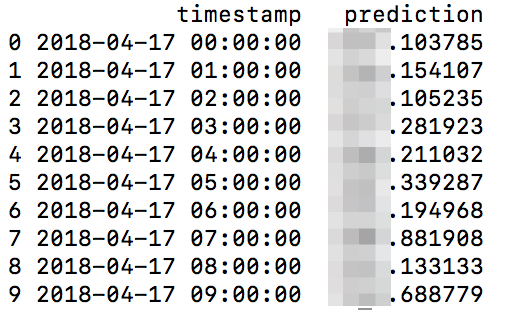

# forecast_sms

Used to (potentially) forecast sms spend for FxA.

## Dependencies (as of right now)
* python2.7 or 3 (tried both seems to work)
* These python libs (`pip install`):
  * pandas
  * numpy
  * scipy
  * [seasonal](https://github.com/welch/seasonal/)

## Usage Example
Definitely liable to change, but as of now:
`python forecast_sms.py [datafile.json] [hours_out_to_predict]`

e.g.

`python forecast_sms.py sms-spend.json 10`

where `10` is how  many **hours** after the last hour in your data to predict out. Obviously predictions will be worse the further out you try to predict. If you don't include the hours it will spit out 24 by default.



Tested with some test data that's not included in this repo.

## Data Format

**Currently data must be generated with the following command**:

```aws --profile prod cloudwatch get-metric-statistics --namespace 'AWS/SNS' --metric-name 'SMSMonthToDateSpentUSD' --start-time '2018-04-01T00:00:00Z' --end-time '2018-04-17T00:00:00Z' --period '3600' --statistics 'Average' > sms-spend.json```

Just sub out the timestamps for the date range you want.
